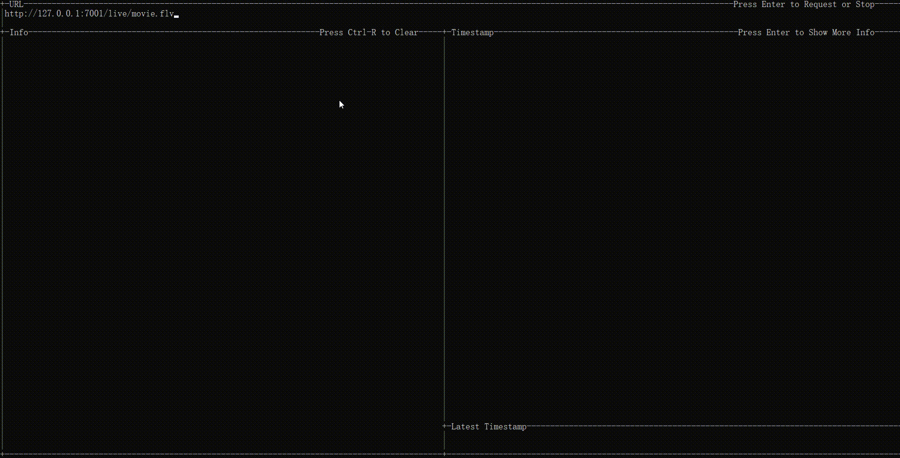

# AV-Spy -- a simple interactive tool to analysis Media data

**Note: Now only support FLV**

## Usage

You can input the http-flv url in Terminal UI, or
```
AV-spy -i <url>
```


## Install
```
go install github.com/foolishCDN/AV-spy/cmd/AV-spy@latest
```


We want to be a human spy to get the secrets of the media world.
You say that the media world is built by humans. 

What? ... (°ー°〃) 